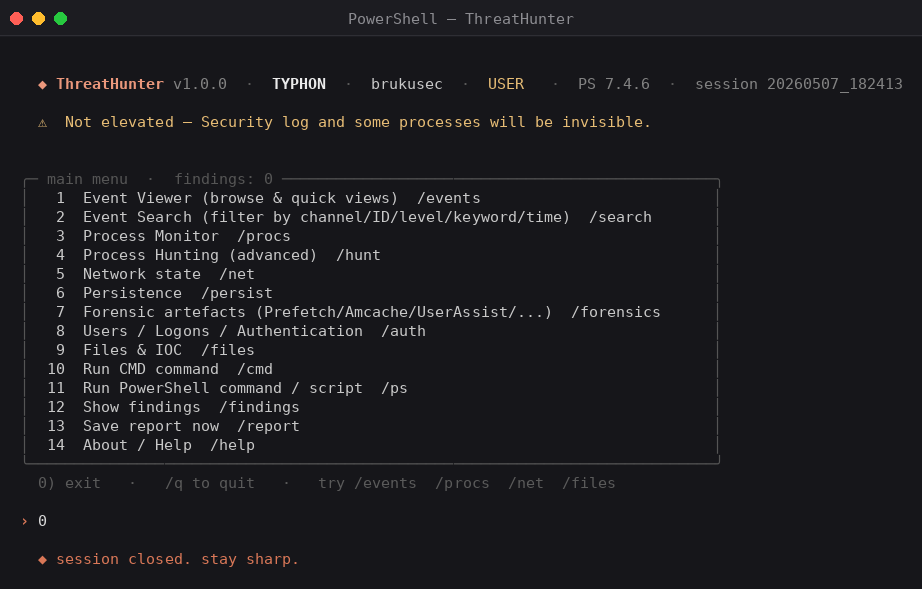
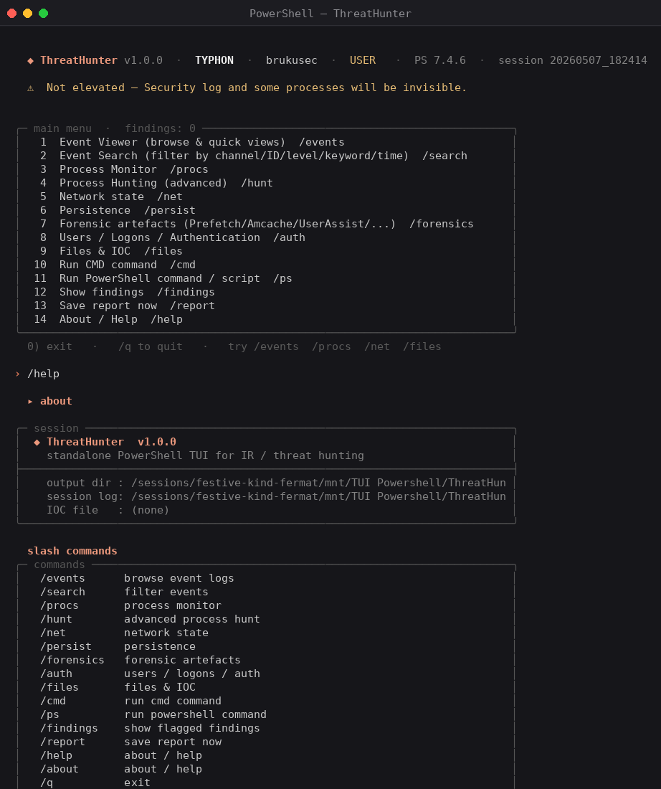
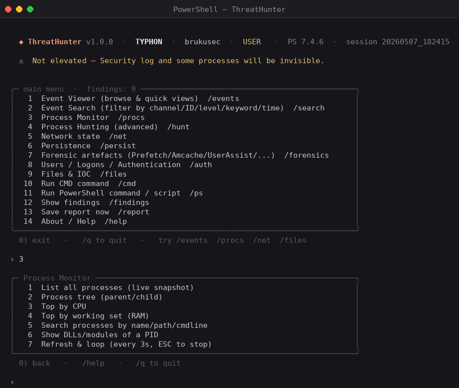
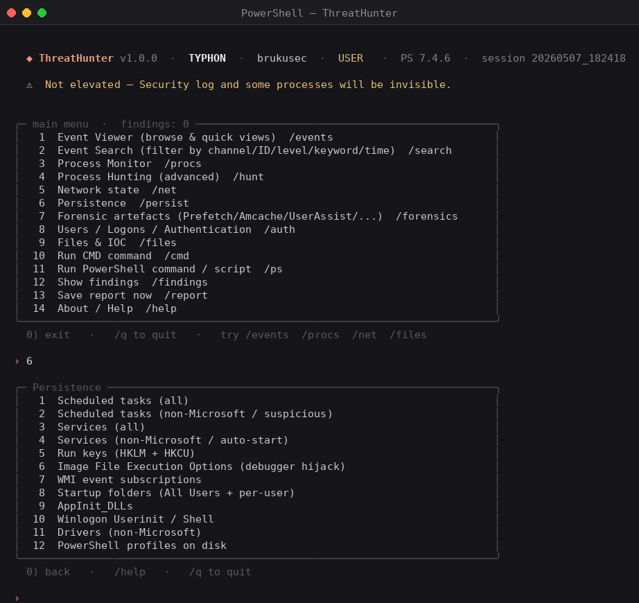
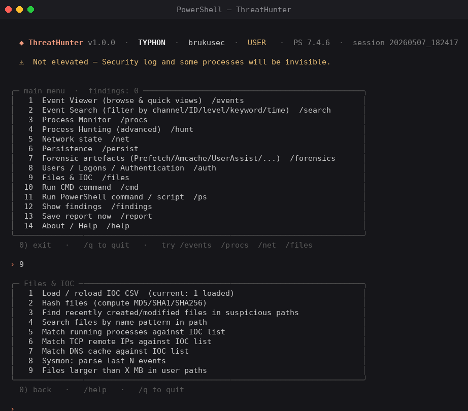
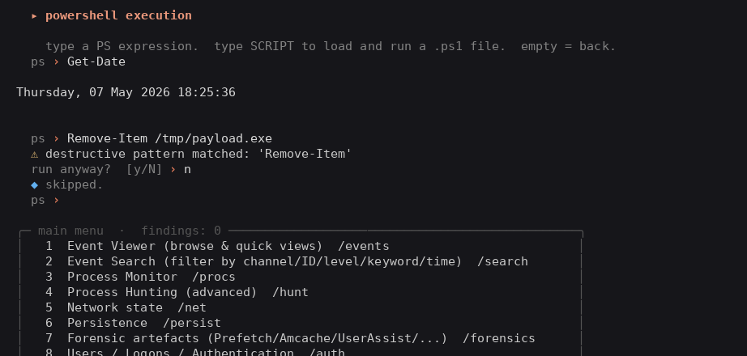
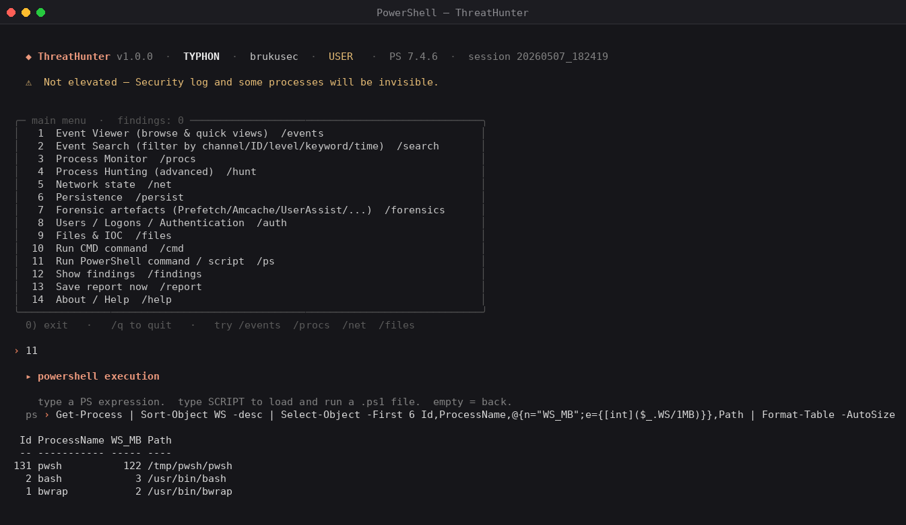

<div align="center">

# ◆ ThreatHunter

**A standalone PowerShell TUI for Windows incident response & threat hunting.**

One file. Zero installs. Zero modules. Eleven curated hunting modules behind a chat-style terminal interface.

[](https://learn.microsoft.com/en-us/powershell/)
[](https://learn.microsoft.com/en-us/powershell/)
[](#compatibility)
[](#why)
[](#license)



</div>

---

## Why

You are looking at a Windows endpoint that may be compromised. You have a remote shell, RDP or physical access, and roughly an hour. You need a consistent set of views over events, processes, network state and persistence — without dragging a toolkit onto the host, and with everything captured as evidence.

ThreatHunter wraps the most useful built-in cmdlets behind one TUI. There is nothing to install, nothing to clean up, and nothing leaves the host without your hand on the keyboard.

## Highlights

| | |
|---|---|
| **Single `.ps1`** | Drop it onto any modern Windows endpoint and run. No modules, no internet, no telemetry. |
| **11 modules** | Events, processes, network, persistence, forensic artefacts, auth, files & IOC, plus arbitrary cmd / PowerShell with a destructive-command guard. |
| **Evidence-aware** | Auto-logged session. Per-view CSV / JSON exports. One-key flagging as findings. Consolidated Markdown report on exit. |
| **Compatible** | Windows PowerShell 5.1 and PowerShell 7+. Auto-detects ANSI / true colour and falls back to console colours when needed. |
| **Operator-friendly** | Numbered menus and slash commands side by side. `/events`, `/procs`, `/net`, `/files`, `/q` … |

---

## Quick start

```powershell
# clone or copy the script onto the target host
git clone https://github.com/<your-org>/ThreatHunter.git
cd ThreatHunter

# launch
.\ThreatHunter.ps1
```

If execution policy gets in the way:

```powershell
powershell.exe -ExecutionPolicy Bypass -File .\ThreatHunter.ps1
```

With an indicator list and a custom output path:

```powershell
.\ThreatHunter.ps1 -IocFile .\iocs.sample.csv -OutputRoot D:\IR\Cases\Q2
```

Run monochrome (restricted terminals / SSH):

```powershell
.\ThreatHunter.ps1 -NoColor -NoLog
```

## Modules

Every module has a slash command for the TUI **and** a parameter switch for non-interactive use (see [Non-interactive / Defender Live Response mode](#non-interactive--defender-live-response-mode)).

| Slash | Module | What it does |
|---|---|---|
| `/events`    | Event Viewer        | Browse channels, quick views over System / Security / PowerShell / Sysmon. |
| `/search`    | Event Search        | Filter by channel, event ID, level, message regex and time range. |
| `/procs`     | Process Monitor     | Live snapshot, parent/child tree, signing, owners, command lines, DLLs. |
| `/hunt`      | Process Hunting     | Pre-built queries: unsigned, suspicious paths, LOLBin chains, network-active. |
| `/net`       | Network state       | TCP/UDP with PID, listening ports, DNS cache, ARP, firewall, SMB. |
| `/persist`   | Persistence         | Tasks, services, run keys, IFEO, WMI subs, Winlogon, drivers, PS profiles. |
| `/forensics` | Forensic artefacts  | Prefetch, Amcache, ShimCache, BAM, RecentApps, UserAssist, MUICache. |
| `/auth`      | Users / Logons      | 4624, 4625, 4672, 4740, 4648, RDP sessions, privileged groups. |
| `/files`     | Files & IOC         | Hashes, recent files, IOC matching (hash / IP / domain / filename), Sysmon parser. |
| `/cmd`       | Run cmd             | Arbitrary `cmd.exe` with destructive-pattern detection. |
| `/ps`        | Run PowerShell      | Arbitrary PowerShell expression or `.ps1` file with pattern detection. |
| `/report`    | Reports             | Findings list, exports index, consolidated Markdown report. |

---

## Screenshots

<table>
  <tr>
    <td align="center"><strong>Main menu</strong><br></td>
    <td align="center"><strong>Help / slash commands</strong><br></td>
  </tr>
  <tr>
    <td align="center"><strong>Process Monitor</strong><br></td>
    <td align="center"><strong>Persistence</strong><br></td>
  </tr>
  <tr>
    <td align="center"><strong>Files &amp; IOC</strong><br></td>
    <td align="center"><strong>Destructive-command guard</strong><br></td>
  </tr>
  <tr>
    <td colspan="2" align="center"><strong>Live result view (Get-Process inside <code>/ps</code>)</strong><br></td>
  </tr>
</table>

---

## Non-interactive / Defender Live Response mode

Every hunting action is also exposed as a **parameter switch**, so the script runs cleanly inside Microsoft Defender Live Response (or any other constrained shell that does not support a TUI). When any action switch is supplied, the script:

* skips the menu entirely,
* auto-detects redirected output and emits **JSON** (so Live Response captures something parseable) or a formatted table when run interactively,
* still writes the full action + output to `session.log` for chain-of-custody,
* exits with a non-zero code on errors so automation can react.

### Recipes

```powershell
# Identity & quick context
.\ThreatHunter.ps1 -Cmd "whoami /all"
.\ThreatHunter.ps1 -Cmd "ipconfig /all"
.\ThreatHunter.ps1 -Cmd "net user"

# PowerShell expressions
.\ThreatHunter.ps1 -PS "Get-Process | Sort-Object CPU -Descending | Select-Object -First 10"
.\ThreatHunter.ps1 -PS "Get-LocalGroupMember Administrators"

# Module quick-views (snapshot in JSON when piped)
.\ThreatHunter.ps1 -Procs
.\ThreatHunter.ps1 -Net
.\ThreatHunter.ps1 -Persist
.\ThreatHunter.ps1 -Auth
.\ThreatHunter.ps1 -Files -Hours 6
.\ThreatHunter.ps1 -Forensics

# Targeted searches
.\ThreatHunter.ps1 -EvtSearch -Channel Security -Id 4624,4625 -Range 24h
.\ThreatHunter.ps1 -EvtSearch -Channel "Microsoft-Windows-PowerShell/Operational" -Id 4104 -Keyword "DownloadString" -Range 7d
.\ThreatHunter.ps1 -ProcSearch -ProcQuery "(powershell|wscript|mshta|rundll32)"
.\ThreatHunter.ps1 -FileSearch -Path C:\Users -Pattern "*.ps1" -Recurse

# Hashing & IOC sweep
.\ThreatHunter.ps1 -Hash -Path C:\Temp -Recurse -Algo SHA256 -IocFile .\iocs.csv
.\ThreatHunter.ps1 -IocMatch -IocFile .\iocs.csv -IocAgainst all

# Run a .ps1 file (with destructive-pattern guard)
.\ThreatHunter.ps1 -Script .\extra-checks.ps1
.\ThreatHunter.ps1 -Script .\extra-checks.ps1 -Force

# Discover what is available
.\ThreatHunter.ps1 -Help            # human-readable help (this list)
.\ThreatHunter.ps1 -ListActions     # machine-readable (JSON-able) action list
```

### Full sub-view matrix

Every TUI menu entry is reachable via parameter. Top-level switches keep their default view; pass `-Sub <name>` to pick a specific sub-view. Pass `-ListActions` at any time for an in-script summary.

| Module | Switch | `-Sub` values |
|---|---|---|
| **Procs** | `-Procs [-Sub <s>]` | `list` *(default)*, `tree`, `topcpu`, `topmem`, `dlls -ProcId N` |
| **Hunt** | `-Hunt -HuntType <k>` | `unsigned`, `paths`, `shortcmd`, `chain`, `owners`, `netactive`, `all` |
| **Net** | `-Net [-Sub <s>]` | `est` *(default)*, `tcp`, `listen`, `udp`, `dns`, `arp`, `route`, `ip`, `firewall`, `smb` |
| **Persist** | `-Persist [-Sub <s>]` | `all` *(default; tasks-susp + services-susp + runkeys)*, `tasks`, `tasks-susp`, `services`, `services-susp`, `runkeys`, `ifeo`, `wmi`, `startup`, `appinit`, `winlogon`, `drivers`, `psprofile` |
| **Forensics** | `-Forensics [-Sub <s>]` | `prefetch` *(default)*, `amcache`, `shimcache`, `bam`, `recentapps`, `userassist`, `muicache` |
| **Auth** | `-Auth [-Sub <s>]` | `priv` *(default)*, `users`, `groups`, `sessions`, `logons` *(4624)*, `failed` *(4625)*, `privlogons` *(4672)*, `lockouts` *(4740)*, `explicit` *(4648)*, `changes` *(4720…4738)*, `rdp`, `pwdage` |
| **Files** | `-Files [-Sub <s>]` | `recent` *(default; `-Hours N`)*, `large` *(`-Mb N`)*, `sysmon` *(`-Range`, `-Id`)* |
| **Events** | `-EvtChannels` | List channels with non-zero record count |
| | `-EvtQuick -Channel <name> [-Count N]` | Quick read of any single channel |
| | `-EvtSearch -Channel <name> -Id <n[,n]> -Level <n> -Keyword <re> -Range <r>` | Filtered Get-WinEvent |
| **Hash / IOC** | `-Hash -Path <p> [-Recurse] [-Algo MD5\|SHA1\|SHA256]` | Hash a file or folder; auto-matches against `-IocFile` if loaded |
| | `-FileSearch -Path <p> -Pattern <wildcard> [-Recurse]` | Find files by name pattern |
| | `-IocMatch -IocFile <csv> [-IocAgainst procs\|tcp\|dns\|all]` | Sweep host live state against the IOC list |
| **Cmd / PS** | `-Cmd <s>` | Run a `cmd.exe` one-liner |
| | `-PS <s>` | Run a PowerShell expression |
| | `-Script <p>` | Run a `.ps1` file |
| | `-Force` | Bypass the destructive-pattern guard |

#### Sub-view examples

```powershell
# Process work
.\ThreatHunter.ps1 -Procs -Sub tree
.\ThreatHunter.ps1 -Procs -Sub topcpu
.\ThreatHunter.ps1 -Procs -Sub dlls -ProcId 1234

# Pre-built hunting queries
.\ThreatHunter.ps1 -Hunt -HuntType unsigned
.\ThreatHunter.ps1 -Hunt -HuntType chain        # LOLBin parents
.\ThreatHunter.ps1 -Hunt -HuntType all          # all six in one go

# Network
.\ThreatHunter.ps1 -Net -Sub listen             # TCP listening
.\ThreatHunter.ps1 -Net -Sub udp                # UDP listening
.\ThreatHunter.ps1 -Net -Sub dns                # DNS client cache
.\ThreatHunter.ps1 -Net -Sub firewall

# Persistence drill-down
.\ThreatHunter.ps1 -Persist -Sub ifeo           # Image File Execution Options
.\ThreatHunter.ps1 -Persist -Sub wmi            # WMI permanent subscriptions
.\ThreatHunter.ps1 -Persist -Sub winlogon
.\ThreatHunter.ps1 -Persist -Sub psprofile

# Forensic artefacts
.\ThreatHunter.ps1 -Forensics -Sub amcache
.\ThreatHunter.ps1 -Forensics -Sub userassist   # ROT13-decoded
.\ThreatHunter.ps1 -Forensics -Sub muicache

# Auth investigation
.\ThreatHunter.ps1 -Auth -Sub failed -Range 24h
.\ThreatHunter.ps1 -Auth -Sub privlogons -Range 7d
.\ThreatHunter.ps1 -Auth -Sub changes -Range 30d
.\ThreatHunter.ps1 -Auth -Sub rdp -Range 7d
.\ThreatHunter.ps1 -Auth -Sub pwdage

# Files
.\ThreatHunter.ps1 -Files -Sub large -Mb 200
.\ThreatHunter.ps1 -Files -Sub sysmon -Range 24h -Id 1,3,11

# Events
.\ThreatHunter.ps1 -EvtChannels
.\ThreatHunter.ps1 -EvtQuick -Channel "Microsoft-Windows-Sysmon/Operational" -Count 200
.\ThreatHunter.ps1 -EvtQuick -Channel Security -Count 100
```


### Output format

| Mode | Default | Override |
|---|---|---|
| Run interactively in a console | Formatted table | `-Format Json` / `-Csv` |
| Output captured / redirected (Live Response, pipe, redirect to file) | **JSON** | `-Format Table` / `-Csv` |
| Force a specific format | — | `-Format Json \| Csv \| Table` |

### Safety in Live Response

The destructive-command guard still applies in non-interactive mode. By default, anything matching the destructive-pattern list (`Remove-Item`, `Stop-Service`, `Clear-EventLog`, `wevtutil cl`, `Set-MpPreference -DisableRealtimeMonitoring`, etc.) is **rejected with exit code 2** and a clean `[ERR]` line on stderr. Add `-Force` only when you know what you are running.

```powershell
.\ThreatHunter.ps1 -PS "Remove-Item C:\Tools\evidence" -Force   # explicit consent required
```

### Defender Live Response — full recipe

```text
# 1. Upload the script and (optionally) an IOC list into the LR file library — one time
PutFile ThreatHunter.ps1
PutFile iocs.csv

# 2. Run it on the target host
run ThreatHunter.ps1 -parameters "-Cmd 'whoami /all'"
run ThreatHunter.ps1 -parameters "-EvtSearch -Channel Security -Id 4624,4625 -Range 24h"
run ThreatHunter.ps1 -parameters "-IocMatch -IocFile iocs.csv"

# 3. Pull the session folder back as evidence
GetFile "ThreatHunt_Output\<session-id>\session.log"
GetFile "ThreatHunt_Output\<session-id>\report.md"
```

### Exit codes

| Code | Meaning |
|---|---|
| 0 | Action ran successfully (the dataset may still be empty) |
| 1 | Fatal exception during execution |
| 2 | Destructive guard fired or required parameter missing |
| 3 | Underlying cmdlet raised (e.g. log channel not found, access denied) |

---

## Hunting workflows

<details>
<summary><b>“Something feels off” — rapid triage in ~10 minutes</b></summary>

```text
/hunt    → unsigned binaries running
/hunt    → procs from Temp / AppData / ProgramData
/net     → established TCP + PID
/persist → tasks (non-Microsoft) + run keys
/q       → save the report
```
</details>

<details>
<summary><b>IOC sweep — you have indicators, check this host</b></summary>

```text
.\ThreatHunter.ps1 -IocFile .\incident.csv

/files  → match running procs against IOC list
/files  → match TCP remotes against IOC list
/files  → match DNS cache against IOC list
/files  → hash %TEMP% and %APPDATA% recursively   (hash hits auto-flag CRITICAL)
/findings → /report
```
</details>

<details>
<summary><b>Auth anomaly — login behaviour investigation</b></summary>

```text
/auth → 4625 failed logons        (24h)
/auth → 4624 successful logons    (LogonType 10 / 3)
/auth → 4672 privileged · 4648 explicit credentials
/auth → account changes (4720…4738)
/auth → RDP session history
```
</details>

---

## IOC CSV format

Three columns. Header row required.

```csv
type,value,description
sha256,e3b0c44298fc1c149afbf4c8996fb92427ae41e4649b934ca495991b7852b855,Empty file placeholder
md5,d41d8cd98f00b204e9800998ecf8427e,Empty file placeholder
ip,185.220.101.1,Sample known-bad IP
domain,malicious-example.com,Sample bad domain
filename,mimikatz.exe,Credential dumping tool
filename,rclone.exe,Often abused for exfiltration
regkey,HKCU:\Software\Classes\ms-settings\shell\open\command,UAC bypass via fodhelper
```

| `type` | matched against |
|---|---|
| `md5` / `sha1` / `sha256` | Hashes computed by the *Hash files* view. |
| `ip`       | Remote address column of `Get-NetTCPConnection`. |
| `domain`   | Substring match against `Entry` in the DNS client cache. |
| `filename` | Substring match against the running process Name **and** Path. |
| `regkey`   | Reference value — listed in the loaded set for context. |

A working sample is shipped as [`iocs.sample.csv`](iocs.sample.csv).

---

## Output & evidence

Every session creates its own folder so the whole thing can be shipped as evidence.

```
ThreatHunt_Output\
└── 20260507_142133\           # session id (YYYYMMDD_HHMMSS)
    ├── session.log            # every action + raw output, append-only
    ├── exports\
    │   ├── 142357_evt_search.csv
    │   ├── 142412_proc_list.json
    │   └── …
    └── report.md              # written on exit, or via /report
```

* `session.log` — timestamped record of every action, the rendered tables, every cmd / PS command and its output, and every flagged finding.
* `exports/`    — CSV / JSON snapshots saved on demand from any result view (key `e`).
* `report.md`   — consolidated Markdown report with session metadata, findings table and exports index.

## Result-view actions

Every result view ends with a short action prompt:

| Key | Action |
|---|---|
| `e` | export current dataset to CSV / JSON / both |
| `f` | flag finding (severity + title + detail) |
| `v` | view all rows (un-paginated) |
| `↵` | continue without exporting / flagging |

## Time range syntax

Anywhere a module asks for a time range, you can type:

```text
1h     6h     24h        # last N hours
7d     30d    90d        # last N days
2w     6w                # last N weeks
3m     12m               # last N calendar months
all                      # epoch → now
2026-04-15..2026-05-07   # explicit, inclusive
```

## Safety net

The cmd and PowerShell modules screen every input against a list of patterns commonly associated with destructive actions and evidence tampering. When a match is found, the action is paused and confirmation is required.

```text
ps › Remove-Item C:\Tools\evidence
⚠ destructive pattern matched: 'Remove-Item'
run anyway?  [y/N] › n
◆ skipped.
```

Patterns include `Remove-Item`, `Format-Volume`, `Stop-Computer`, `taskkill`, `Stop-Service`, `Clear-EventLog`, `wevtutil cl`, `reg delete`, `Disable-NetAdapter`, `netsh advfirewall reset`, `Invoke-Expression`, `iex`, `DownloadString`, `Set-MpPreference -DisableRealtimeMonitoring`, `cipher /w`, `sdelete`, and others. This is a hint, not a hard block — confirming with `y` runs the command as-is. Every command and its output is appended to the session log regardless.

---

## Compatibility

| | |
|---|---|
| Windows 10 / 11 | ✓ |
| Windows Server 2016+ | ✓ |
| Windows PowerShell 5.1 | ✓ |
| PowerShell 7+ | ✓ |
| Windows Terminal | ✓ true colour |
| `conhost.exe` (legacy) | ✓ falls back to console colours |
| VS Code terminal | ✓ |
| ConEmu | ✓ |

Admin is **recommended but not required**. The banner shows `ADMIN` or `USER`. Without elevation, the Security log and full process inventory are partially or fully invisible — the TUI tells you when that affects a result.

## Parameters

| Parameter | Description |
|---|---|
| `-OutputRoot <path>` | Root for session folders. Defaults to `.\ThreatHunt_Output\`. |
| `-IocFile <path>`    | CSV of indicators (see format above). Loaded on demand. |
| `-NoLog`             | Disable session logging entirely (also disables exports / report). |
| `-NoColor`           | Force monochrome output. Useful in restricted terminals. |

---

## Documentation

This repository ships full documentation:

* **[`ThreatHunter-Guide.html`](ThreatHunter-Guide.html)** — full UK-English reference manual (single self-contained HTML).
* **[`ThreatHunter-Presentation.pptx`](ThreatHunter-Presentation.pptx)** — slide deck overview of the tool.
* **[`ThreatHunter-Presentation.pdf`](ThreatHunter-Presentation.pdf)** — PDF export of the deck.
* **[`iocs.sample.csv`](iocs.sample.csv)** — starter IOC list to use as a template.

---

## Repository layout

```
ThreatHunter/
├── ThreatHunter.ps1               # the script itself
├── iocs.sample.csv                # sample IOC list
├── ThreatHunter-Guide.html        # full user guide
├── ThreatHunter-Presentation.pptx
├── ThreatHunter-Presentation.pdf
├── docs/
│   └── screenshots/               # images used by this README
└── README.md
```

---

## Contributing

Issues and pull requests are welcome. Useful directions:

* New modules (DPAPI keys, Defender exclusions, BITS jobs, RDP cache, etc.).
* Better Sysmon parsing — friendly views per Event ID rather than raw messages.
* Additional destructive-pattern coverage.
* Locale / language packs for the prompts.

When opening an issue, include the PowerShell version, the host OS build, and a redacted excerpt from `session.log` if relevant.

## License

MIT — see [`LICENSE`](LICENSE).

> ThreatHunter is provided **as-is**, with no warranty. It is intended to be operated by analysts who understand the actions being taken on the host. Some operations (cmd / PowerShell execution, registry reads in privileged hives, scanning sensitive paths) may interact with monitoring on the endpoint. Always review your organisation’s policies before running it on production systems.

---

<div align="center">
<sub>Built for the analyst on the keyboard. ◆ Stay sharp.</sub>
</div>
